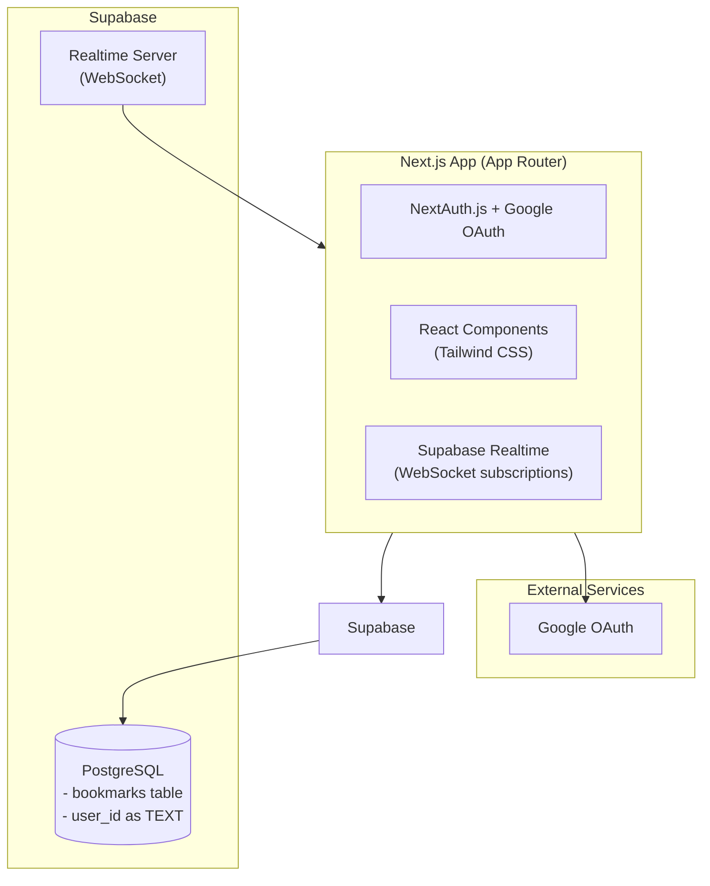

# Smart Bookmark App

A modern bookmark manager built with Next.js, Supabase, and Google OAuth. Features real-time synchronization across multiple browser tabs.

**Live Demo**: [https://smart-bookmark-app.vercel.app](https://smart-bookmark-app.vercel.app)

## Features

- **Google OAuth Authentication**: Secure sign-in with Google (no passwords to remember)
- **Add Bookmarks**: Save URLs with custom titles
- **Private Bookmarks**: Each user only sees their own bookmarks (enforced by API-level authorization)
- **Real-time Sync**: Changes appear instantly across all open tabs using Supabase Realtime WebSockets
- **Delete Bookmarks**: Remove bookmarks with confirmation
- **Responsive Design**: Works on desktop and mobile devices
- **Modern UI**: Clean, polished interface with Tailwind CSS

## Tech Stack

- **Framework**: [Next.js 14](https://nextjs.org/) with App Router
- **Authentication**: [NextAuth.js](https://next-auth.js.org/) with Google Provider
- **Database**: [Supabase](https://supabase.com/) (PostgreSQL + Realtime)
- **Styling**: [Tailwind CSS](https://tailwindcss.com/)
- **Deployment**: [Vercel](https://vercel.com/)

## Architecture



## Database Schema

```sql
CREATE TABLE bookmarks (
  id UUID PRIMARY KEY DEFAULT gen_random_uuid(),
  user_id TEXT NOT NULL,
  url TEXT NOT NULL,
  title TEXT NOT NULL,
  created_at TIMESTAMPTZ DEFAULT NOW(),
  updated_at TIMESTAMPTZ DEFAULT NOW()
);

-- Enable Realtime for bookmarks table
ALTER PUBLICATION supabase_realtime ADD TABLE bookmarks;
```

Note: Row Level Security (RLS) is not used because authentication is handled by NextAuth.js via server-side API routes.

## Problems Encountered and Solutions

### 1. Google OAuth User ID Format vs UUID

**Problem**: The Google OAuth user ID is a numeric string (e.g., "108821821091653268280"), but the initial database schema defined `user_id` as UUID type. This caused errors:
```
invalid input syntax for type uuid: "108821821091653268280"
```

**Solution**: Changed the database schema to use `TEXT` type for `user_id` instead of `UUID`. This allows storing any OAuth provider's user ID format without type constraints.

### 2. Supabase RLS with NextAuth.js

**Problem**: Supabase's Row Level Security (RLS) policies expect authentication through Supabase Auth (`auth.uid()`), but the app uses NextAuth.js for Google OAuth. The `session.user.id` from NextAuth doesn't match Supabase's auth system.

**Solution**: Implemented server-side API routes (`/api/bookmarks`) that use the Supabase service role key to bypass RLS. User authorization is enforced at the API level by checking the NextAuth session before database operations.

### 3. Real-time Synchronization Across Tabs

**Problem**: Requirement #4 specified that bookmarks should update in real-time across multiple tabs without page refresh.

**Solution**: Implemented Supabase Realtime subscriptions using WebSockets. The client subscribes to database changes filtered by `user_id`:

```typescript
const subscription = supabase
  .channel(`bookmarks:${session.user.id}`)
  .on(
    "postgres_changes",
    {
      event: "*",
      schema: "public",
      table: "bookmarks",
      filter: `user_id=eq.${session.user.id}`,
    },
    (payload) => {
      // Handle INSERT, UPDATE, DELETE events
      // Update local React state instantly
    }
  )
  .subscribe();
```

This provides true real-time sync - when a bookmark is added in one tab, it appears instantly in all other tabs without polling or refresh.

### 4. Google OAuth Redirect URI Mismatch

**Problem**: Google OAuth requires configuring authorized redirect URIs in advance. The app initially showed:
```
Error 400: redirect_uri_mismatch
```

**Solution**: Added the correct redirect URI to Google Cloud Console:
- `http://localhost:3000/api/auth/callback/google` (for development)
- `https://your-vercel-app.vercel.app/api/auth/callback/google` (for production)

### 5. Database Schema Migration

**Problem**: When fixing the user_id type issue, needed to recreate the table without losing data integrity.

**Solution**: Used `DROP TABLE IF EXISTS` followed by `CREATE TABLE` with the corrected schema. Since the table was empty during development, this was safe. For production, a proper migration strategy would use `ALTER TABLE` commands.

## Environment Variables

Create a `.env.local` file with the following:

```bash
# Supabase
NEXT_PUBLIC_SUPABASE_URL=your-supabase-url
NEXT_PUBLIC_SUPABASE_ANON_KEY=your-anon-key
SUPABASE_SERVICE_ROLE_KEY=your-service-role-key

# NextAuth
NEXTAUTH_URL=http://localhost:3000
NEXTAUTH_SECRET=your-secret-key-min-32-characters-long

# Google OAuth
GOOGLE_CLIENT_ID=your-google-client-id
GOOGLE_CLIENT_SECRET=your-google-client-secret
```

## Setup Instructions

### 1. Supabase Setup

1. Create a new project at [supabase.com](https://supabase.com)
2. Go to Project Settings > API to get your URL and anon key
3. Go to Project Settings > API > Service Role to get your service role key
4. Run the SQL from `supabase/migrations/001_initial_schema.sql` in the SQL Editor:
   ```sql
   DROP TABLE IF EXISTS bookmarks;

   CREATE TABLE bookmarks (
     id UUID PRIMARY KEY DEFAULT gen_random_uuid(),
     user_id TEXT NOT NULL,
     url TEXT NOT NULL,
     title TEXT NOT NULL,
     created_at TIMESTAMPTZ DEFAULT NOW(),
     updated_at TIMESTAMPTZ DEFAULT NOW()
   );

   ALTER PUBLICATION supabase_realtime ADD TABLE bookmarks;
   ```
5. Enable Realtime for the `bookmarks` table in Database > Replication

### 2. Google Cloud Console Setup

1. Go to [Google Cloud Console](https://console.cloud.google.com/)
2. Create a new project or select existing
3. Go to APIs & Services > Credentials
4. Click "Create Credentials" > "OAuth client ID"
5. Configure OAuth consent screen (External type)
6. Add authorized redirect URIs:
   - `http://localhost:3000/api/auth/callback/google`
   - `https://your-vercel-app.vercel.app/api/auth/callback/google`
7. Copy the Client ID and Client Secret

### 3. Local Development

```bash
# Clone the repository
git clone https://github.com/yourusername/smart-bookmark-app.git

# Install dependencies
npm install

# Set up environment variables
cp .env.local.example .env.local
# Edit .env.local with your values

# Run the development server
npm run dev
```

### 4. Deployment to Vercel

1. Push code to GitHub
2. Import project in Vercel
3. Add environment variables in Vercel dashboard (same as `.env.local` but with production values)
4. Update `NEXTAUTH_URL` to your Vercel domain
5. Add the Vercel redirect URI to Google Cloud Console
6. Deploy

## Project Structure

```
smart-bookmark-app/
├── src/
│   ├── app/
│   │   ├── api/
│   │   │   ├── auth/[...nextauth]/   # NextAuth API route
│   │   │   └── bookmarks/            # Bookmarks CRUD API
│   │   ├── auth/signin/             # Sign-in page
│   │   ├── layout.tsx               # Root layout
│   │   └── page.tsx                 # Home page
│   ├── components/
│   │   ├── AddBookmarkForm.tsx      # Form to add bookmarks
│   │   ├── AuthButton.tsx           # Sign in/out button
│   │   ├── BookmarkItem.tsx         # Individual bookmark card
│   │   ├── BookmarkList.tsx         # Main bookmark list with realtime
│   │   └── Providers.tsx            # Session provider
│   ├── lib/
│   │   ├── auth.ts                  # NextAuth configuration
│   │   └── supabase/
│   │       ├── client.ts            # Supabase client (for realtime)
│   │       ├── server.ts            # Supabase server client (for API routes)
│   │       └── database.types.ts    # TypeScript types
│   └── types/
│       └── bookmark.ts              # Bookmark interface
├── supabase/migrations/             # Database migrations
├── .env.local.example               # Environment variables template
└── README.md                        # This file
```

## How Real-time Works

1. **Client Subscription**: When a user logs in, the `BookmarkList` component creates a Supabase Realtime subscription filtered by their `user_id`
2. **Database Changes**: When any bookmark is INSERTed, UPDATEd, or DELETEd, Supabase broadcasts the change via WebSocket
3. **State Update**: The client receives the payload and updates React state instantly
4. **Cross-Tab Sync**: Since all tabs subscribe to the same user_id filter, they all receive updates simultaneously

## License

MIT License - feel free to use this project as a template for your own applications.
